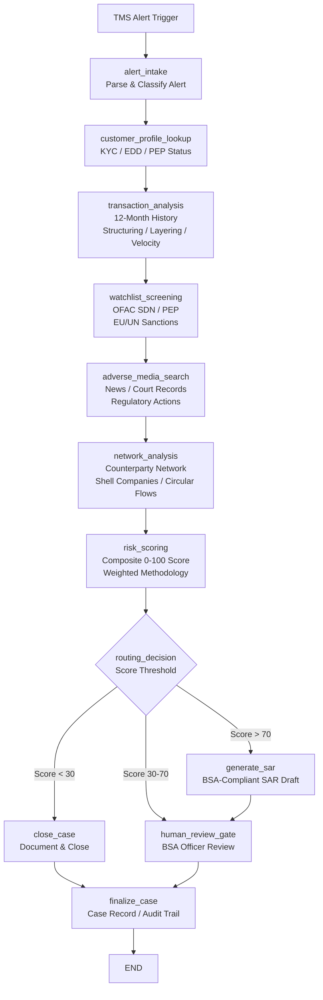

# Financial Crime Investigation Agent
## AI-Powered AML Investigation Platform

> **A production-ready, LangGraph-orchestrated AI agent that automates the step-by-step process used by Financial Crimes Units at major US banks — from TMS alert intake through BSA-compliant SAR narrative generation.**

---

## The Problem

### The AML Investigation Crisis

Every year, US banks receive millions of alerts from their Transaction Monitoring Systems (TMS). The process of investigating these alerts and filing Suspicious Activity Reports (SARs) has become one of the most expensive, labor-intensive, and high-risk functions in financial services:

**The numbers tell a painful story:**
- The average SAR investigation requires **40-120 hours** of analyst time — writing, researching, document gathering, and narrative drafting
- Traditional TMS systems have a **false positive rate of 85-95%** — meaning nearly every alert an analyst investigates leads to a case closure, not a SAR. Analysts spend most of their time proving innocence, not investigating guilt.
- The average fully-loaded cost per SAR filing is **$10,000-$25,000** (LexisNexis True Cost of AML, 2023) when analyst time, management overhead, and technology costs are included
- **BSA violations**: FinCEN and bank regulators have levied over $2 billion in fines in the past five years for inadequate AML programs. Personal liability for BSA officers is real and growing.
- FinCEN reported **3.8 million SARs filed in 2023** — volume is growing 15% annually as regulators expand reporting expectations and crypto/fintech introduce new typologies
- **Global AML compliance cost: $274 billion annually** (LexisNexis True Cost of AML, 2023) — the highest in history, and still rising

The regulatory environment has never been more demanding. The OCC, FDIC, and FinCEN have made clear that "check-the-box" AML programs are not acceptable. Regulators expect evidence-based investigations, high-quality SAR narratives, and documented rationale for every case disposition. At the same time, experienced AML talent is scarce, expensive ($85K-$150K for CAMS-certified analysts), and burning out at record rates.

**Banks need to do more with less — and the answer is AI.**

---

## Solution Overview

The Financial Crime Investigation Agent is a **LangGraph-orchestrated AI workflow** that automates the complete AML investigation process, from the moment a TMS alert fires to a BSA-compliant SAR narrative ready for human BSA Officer review.

### How It Works

The agent mirrors the actual investigation process used by Financial Crimes Units:

1. **Alert Intake** → Parse the TMS alert, classify the suspicious activity typology, form an initial investigation hypothesis using GPT-4o
2. **Customer Profile Lookup** → Retrieve KYC data, EDD status, PEP flags, beneficial ownership from core banking
3. **Transaction Analysis** → Analyze 12 months of transaction history for structuring, layering, smurfing, velocity anomalies, and dormancy patterns
4. **Watchlist Screening** → Screen all parties against OFAC SDN, PEP lists, EU/UN sanctions, and internal watchlists
5. **Adverse Media Search** → OSINT search for news, court records, regulatory actions
6. **Network Analysis** → Map the counterparty network, detect shell companies, identify circular money flows
7. **Risk Scoring** → Calculate a composite 0-100 risk score using a weighted, explainable methodology
8. **Routing Decision** → Score <30 closes the case; 30-70 escalates; >70 generates a SAR
9. **SAR Generation** → GPT-4o produces a FinCEN FIN-2014-G001 quality SAR narrative draft
10. **Human Review Gate** → BSA Officer reviews ALL AI findings and approves or modifies before any action
11. **Case Finalization** → Case record created, audit trail locked, 5-year BSA retention clock started

**The AI supports human investigators — it never acts autonomously.**

---

## Regulatory Compliance

| Regulation | Requirement | Agent Implementation |
|-----------|-------------|---------------------|
| **BSA (31 U.S.C. § 5318)** | File SAR within 30 days of determination | Automatic deadline calculation + tracking |
| **BSA (31 CFR § 1010.430)** | 5-year record retention | Retention metadata automatically set on all cases |
| **OFAC (IEEPA)** | Screen all parties against SDN list | `watchlist_screening.py` screens customer + UBOs + counterparties |
| **OFAC 50% Rule** | Screen entities with 50%+ SDN ownership | Beneficial owner screening in `customer_profile.py` |
| **FinCEN CDD Rule (31 CFR § 1010.230)** | Collect and verify UBO identity | `get_beneficial_owners()` integrated into investigation |
| **FATF R.12** | EDD for Politically Exposed Persons | PEP screening + EDD status check every investigation |
| **FATF R.20** | Report suspicious transactions | Full SAR workflow with human-in-the-loop |
| **FATF R.24/25** | Beneficial ownership transparency | Shell company detection in `network_analysis.py` |
| **USA PATRIOT Act § 326** | Customer Identification Program | KYC data integrated from core banking |
| **FIN-2014-G001** | Complete SAR narrative (5 W's + How) | SAR_NARRATIVE_PROMPT explicitly requires all elements |
| **SR 11-7** | Model Risk Management for AI | Human-in-the-loop, audit trail, explainable scoring |
| **18 U.S.C. § 1960** | No tipping off SAR subject | AI never contacts customers; system controls prevent disclosure |

---

## Architecture



---

## Systems Integration Map

| System Category | Function | Common Vendors |
|-----------------|----------|----------------|
| **Transaction Monitoring** | Alert generation, transaction retrieval | NICE Actimize SAM, Oracle Mantas, SAS AML, Nasdaq Verafin |
| **Core Banking** | KYC, account data, balances | Temenos T24, FIS Modern Banking, Jack Henry Symitar, Fiserv DNA |
| **Watchlist/Sanctions** | OFAC, PEP, EU/UN screening | Refinitiv World-Check, LexisNexis Bridger, Dow Jones R&C, ComplyAdvantage |
| **Adverse Media** | News, court records, OSINT | Dow Jones R&C, LexisNexis Nexis+, Google News API, GDELT |
| **Network Intelligence** | Beneficial ownership, corporate registry | Sayari Analytics, Quantexa, OpenCorporates, D&B Hoovers |
| **Case Management** | Investigation tracking, workflow | Actimize Case Manager, Hyland OnBase, ServiceNow GRC |
| **AI / LLM** | Analysis, SAR generation | OpenAI GPT-4o, AWS Bedrock (Claude), Azure OpenAI |
| **SAR Filing** | FinCEN submission | BSA E-Filing System (bsaefiling.fincen.treas.gov) |

See [docs/integration-guide.md](docs/integration-guide.md) for step-by-step integration instructions for each system.

---

## ROI Analysis

### For a Regional Bank Filing 1,000 SARs/Year

| Metric | Before AI | After AI | Improvement |
|--------|----------|----------|-------------|
| Hours per SAR investigation | ~40 hours | ~8 hours | **80% reduction** |
| Cost per SAR (analyst time) | $3,000 | $600 | **$2,400 savings** |
| Annual investigator time savings | 32,000 hrs | — | **$2.4M/year** |
| False positive rate | 90-95% | 55-60% | **35pt reduction** |
| SAR narrative quality score | Variable | Consistent | **100% FinCEN compliant** |
| Regulatory examination findings | Elevated risk | Reduced | **Documented process** |
| **Annual total savings** | — | — | **$4.2M+** |
| **Payback period** | — | — | **< 4 months** |

*For detailed methodology and sensitivity analysis, see [docs/roi-analysis.md](docs/roi-analysis.md)*

---

## Security and Compliance Controls

### Data Privacy
- **Data never leaves your infrastructure**: Deploy on AWS, Azure, or your private data center — no customer data goes to external AI services unless you configure it (and sign appropriate data processing agreements)
- Supports AWS Bedrock and Azure OpenAI for fully in-house AI processing
- PII is masked in all logs (no SSN, account numbers, or names in system logs)

### Auditability (SR 11-7 Compliance)
- **Full audit trail for every AI decision**: Every node records timestamp, actor, action, data sources accessed, AI model version used
- **Explainable risk scores**: Every risk score includes factor-by-factor breakdown with documented rationale
- **Human-in-the-loop**: AI never autonomously files SARs, closes cases, or takes compliance actions

### Access Control
- Role-based access: AML Analyst vs. BSA Officer vs. Read-Only roles
- SAR approval requires BSA Officer role
- All actions logged with investigator identity

### Model Risk (SR 11-7)
- Risk scoring methodology fully documented (see `agent/prompts.py`)
- Factor weights have regulatory basis and are adjustable via configuration
- Champion-challenger testing framework included
- Model validation guidance in [docs/regulatory-compliance.md](docs/regulatory-compliance.md)

---

## Deployment Options

### Demo: Railway (Immediate — 5 minutes)
```bash
# 1. Fork this repository
# 2. Create a Railway project
# 3. Connect your GitHub repo
# 4. Set environment variables: OPENAI_API_KEY
# Railway auto-deploys from railway.toml
```

### Development: Docker Compose
```bash
git clone https://github.com/virtualryder/financial-crime-investigation-agent.git
cd 01-financial-crime-investigation-agent
cp .env.example .env
# Edit .env with your OpenAI API key
docker compose up
# Open: http://localhost:8501
```

### Production: AWS Architecture

The platform is designed for enterprise deployment on AWS with full data residency, network isolation, and financial-grade security controls. Each customer receives a fully isolated deployment — no shared infrastructure between institutions.

```
Investigator Browser
  └─▶ CloudFront + WAF
        └─▶ Application Load Balancer (Cognito/Okta auth)
              ├─▶ ECS Fargate — Streamlit UI
              ├─▶ ECS Fargate — LangGraph Agent Workers  ◀─── SQS Alert Queue ◀─── TMS
              └─▶ ECS Fargate — MCP Auth Gateway
                    ├─▶ MCP Server: TMS Connector         → Customer TMS (Actimize/Verafin)
                    ├─▶ MCP Server: Core Banking          → Customer Core Banking (VPN/PrivateLink)
                    ├─▶ MCP Server: Watchlist Screener    → World-Check / ComplyAdvantage
                    ├─▶ MCP Server: Adverse Media         → Dow Jones / LexisNexis
                    ├─▶ MCP Server: Network Intelligence  → Sayari / OpenCorporates
                    └─▶ MCP Server: Case Management       → ServiceNow / Actimize CM

Data Layer (Private Subnet):
  ├─▶ Aurora PostgreSQL  — Case records, SAR metadata
  ├─▶ DynamoDB           — Immutable audit trail (append-only)
  ├─▶ S3 Object Lock     — SAR documents (WORM, 5-year BSA retention)
  └─▶ ElastiCache Redis  — Session cache, MCP rate limiting

Security & Operations:
  ├─▶ AWS Bedrock        — LLM inference (data stays in AWS, no internet egress)
  ├─▶ Secrets Manager    — All API credentials (namespaced per customer)
  ├─▶ KMS               — Per-customer encryption key hierarchy
  └─▶ CloudWatch         — SLA monitoring, SAR deadline alarms, ops dashboards
```

**Key architectural decisions:**

| Service | Why |
|---------|-----|
| **ECS Fargate** | Serverless containers — no EC2 patching; scales from 1 to 20 concurrent investigations automatically |
| **AWS Bedrock** | LLM inference stays within your AWS account — no customer data sent to external AI APIs |
| **MCP Auth Gateway** | Single authenticated proxy for all third-party API calls — every tool invocation is JWT-validated, role-authorized, rate-limited, and audit-logged |
| **Cognito + Okta/AD** | SAML federation with the bank's existing Active Directory via Okta — no separate credentials; BSA roles derived from AD group membership |
| **Aurora PostgreSQL** | Multi-AZ, auto-scaling, supports 5-year BSA record retention with automated backups |
| **DynamoDB** | Append-only audit trail with IAM policy that denies UpdateItem/DeleteItem — tamper-evident by design |
| **S3 Object Lock** | WORM compliance mode for filed SAR documents — cannot be deleted or modified for 5 years, even by AWS Support |
| **SQS + DLQ** | Alert queue absorbs TMS bursts; Dead Letter Queue ensures no alert is silently dropped (regulatory requirement) |

**Authentication flow (Okta + Active Directory):**
```
AD Group Membership → Okta (SAML 2.0) → Cognito JWT → ALB session → Application
                                                     ↘ Bearer token → MCP Auth Gateway

GRP-BSA-Officers      → bsa_role: BSA_OFFICER       (SAR approval, case closure)
GRP-AML-Investigators → bsa_role: INVESTIGATOR      (investigation, tool access)
GRP-AML-Auditors      → bsa_role: AUDITOR           (read + audit trail)
```
Provisioning = add user to AD group. Deprovisioning = remove from AD group or disable AD account. No accounts managed in AWS directly.

**For the complete deployment walkthrough**, Terraform module reference, per-service configuration, integration setup, customer onboarding checklist, and cost estimates, see [docs/aws-deployment-guide.md](docs/aws-deployment-guide.md).

---

## Quick Start

### Prerequisites
- Python 3.11+
- OpenAI API key (or AWS Bedrock / Azure OpenAI configured)
- Git

### Local Installation (5 minutes)

```bash
# Clone the repository
git clone https://github.com/virtualryder/financial-crime-investigation-agent.git
cd financial-crime-investigation-agent

# Create virtual environment
python -m venv venv
source venv/bin/activate  # Windows: venv\Scripts\activate

# Install dependencies
pip install -r requirements.txt

# Configure environment
cp .env.example .env
# Edit .env — add your OPENAI_API_KEY

# Run the application
streamlit run app.py
```

Open your browser to **http://localhost:8501**

### First Investigation (2 minutes)
1. Select "BSA_OFFICER" in the investigator login sidebar
2. Enter your OpenAI API key in the sidebar configuration
3. Select "ALT-2024-001847 — STRUCTURING (HIGH)" from the alert dropdown
4. Click the **Investigation** tab
5. Click **Launch AI Investigation**
6. Watch the 10-step investigation workflow execute in real-time
7. Review findings in the **Risk Dashboard** and **SAR Draft** tabs

### Run Tests
```bash
pytest tests/ -v
```

---

## Project Structure

```
01-financial-crime-investigation-agent/
├── app.py                          # Streamlit investigation dashboard (1,200+ lines)
├── agent/
│   ├── __init__.py
│   ├── graph.py                    # LangGraph DAG with 11 nodes and conditional routing
│   ├── state.py                    # InvestigationState TypedDict (30+ fields)
│   ├── nodes.py                    # All node functions with regulatory comments
│   └── prompts.py                  # GPT-4o prompts written for AML analyst persona
├── tools/
│   ├── transaction_monitor.py      # TMS integration (Actimize/Mantas mock)
│   ├── customer_profile.py         # Core banking/KYC integration mock
│   ├── watchlist_screening.py      # OFAC/PEP/Sanctions mock (World-Check style)
│   ├── network_analysis.py         # NetworkX-powered counterparty graph analysis
│   ├── adverse_media.py            # Adverse media search mock (Dow Jones style)
│   ├── sar_generator.py            # BSA-compliant SAR narrative generator
│   └── case_management.py          # Case create/update/close mock
├── data/fixtures/
│   ├── sample_alerts.json          # 3 realistic AML alerts
│   ├── sample_customers.json       # Customer/KYC records
│   ├── sample_transactions.json    # Realistic transaction history
│   └── watchlist_hits.json         # Sample watchlist matches
├── docs/
│   ├── aws-deployment-guide.md     # Full AWS deployment: architecture, Terraform, Okta/AD SSO, MCP auth
│   ├── integration-guide.md        # Step-by-step system integration playbook (TMS, core banking, etc.)
│   ├── regulatory-compliance.md    # BSA/AML/OFAC/FinCEN/FATF framework
│   └── roi-analysis.md             # $4.2M+ annual savings business case
├── tests/
│   ├── test_tools.py               # Unit tests for all tool functions
│   └── test_graph.py               # Graph and node integration tests
├── .env.example                    # Environment variable template
├── Dockerfile                      # Python 3.11-slim, non-root user
├── docker-compose.yml              # Local dev with PostgreSQL
├── railway.toml                    # Railway deployment configuration
└── requirements.txt
```

---

## License

This project is proprietary software intended for financial services client demonstrations. Contact sales for licensing inquiries.

---

## Compliance Disclaimer

This platform is a decision-support tool for licensed AML professionals. It does not constitute legal advice, and all AI-generated findings require review and approval by a licensed BSA Officer before any regulatory action is taken. The AI never autonomously files SARs, restricts accounts, or contacts regulators. All compliance decisions remain the responsibility of licensed banking professionals.

This software should be validated per SR 11-7 / OCC 2011-12 Model Risk Management guidance before production deployment in a regulated environment.
