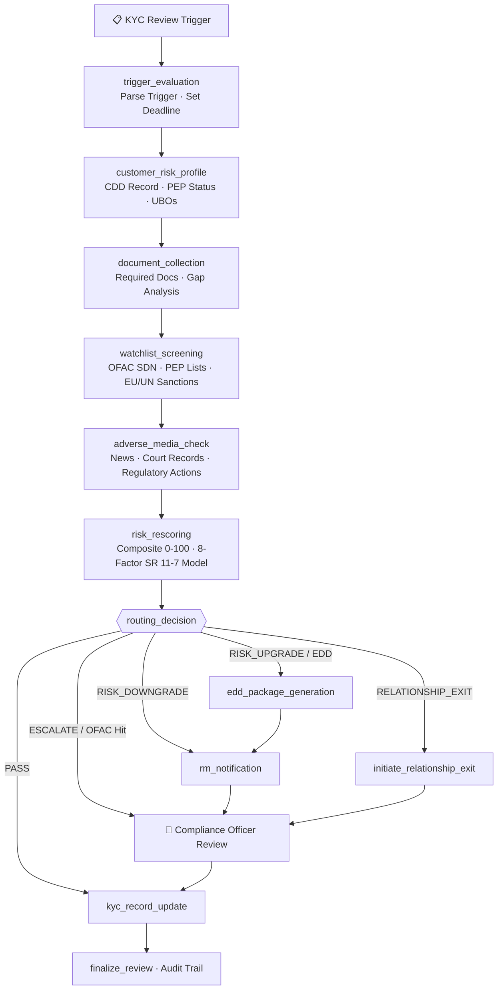

# KYC/CDD Perpetual Monitoring Agent
### Automated Customer Due Diligence Refresh — Event-Driven & Scheduled

> **Part of the [Financial Services AI Agent Suite](../README.md)** — extends the [Financial Crime Investigation Agent](../01-financial-crime-investigation-agent/) and [AML/TMS Enhancement Agent](../02-aml-tms-enhancement-agent/) by automating the upstream CDD/KYC lifecycle that feeds both.

---

## The Problem

A mid-sized bank with 10,000 business customers:
- **High-risk (annual review):** 1,500 customers × 8 hrs manual review = 12,000 hrs/year
- **Event-driven triggers:** 200+ per month from adverse media, watchlist hits, transaction spikes
- **Regulatory exam findings:** "Inadequate periodic review program" is a top-10 BSA exam citation
- **EDD backlogs:** PEP and high-risk customers often sit without required EDD for months

**This agent automates ~90% of the review workflow.** Analysts handle exceptions; the agent handles the routine.

---

## Workflow

```
┌─────────────────────────────────────────────────────────────────────┐
│                 KYC/CDD Perpetual Monitoring Agent                   │
│                                                                     │
│  TRIGGER (scheduled OR event-driven)                                │
│         ↓                                                           │
│  trigger_evaluation → customer_risk_profile → document_collection   │
│         ↓                                                           │
│  watchlist_screening → adverse_media_check → risk_rescoring         │
│         ↓                                                           │
│  ┌─────────────────────────────────────┐                           │
│  │         Routing Decision            │                           │
│  │  PASS → kyc_record_update           │                           │
│  │  RISK_UPGRADE → EDD package → RM    │                           │
│  │  EDD_REQUIRED → EDD package → RM    │                           │
│  │  RISK_DOWNGRADE → RM notification   │                           │
│  │  ESCALATE → Human review (direct)   │                           │
│  │  REL_EXIT → Exit docs → Human       │                           │
│  └─────────────────────────────────────┘                           │
│         ↓                                                           │
│  👤 Compliance Officer Review Gate (for non-PASS outcomes)          │
│         ↓                                                           │
│  kyc_record_update → finalize_review → append-only audit log        │
└─────────────────────────────────────────────────────────────────────┘
```

### Workflow Diagram (Mermaid)



---

## Review Triggers

| Trigger Type | Urgency | Review Deadline | Auto-EDD? |
|---|---|---|---|
| `WATCHLIST_HIT` (OFAC/PEP) | Critical | 3 days | Yes (always) |
| `SAR_FILED` | High | 7 days | Yes |
| `ADVERSE_MEDIA` | High | 7 days | If severity HIGH+ |
| `RISK_MODEL_FLAG` | Moderate | 14 days | If score ≥ 70 |
| `TRANSACTION_SPIKE` | Moderate | 14 days | If ≥ 200% above ceiling |
| `BENEFICIAL_OWNER_CHANGE` | Moderate | 14 days | Yes |
| `JURISDICTION_CHANGE` | Standard | 30 days | If new jurisdiction is HIGH risk |
| `NEW_PRODUCT` | Standard | 30 days | If product is high-risk |
| `MANUAL` / `REGULATORY_EXAM` | Standard | 30 days | Per Compliance Officer |
| `SCHEDULED` | Routine | 60 days | Per risk tier |

---

## Routing Outcomes

| Outcome | Trigger Conditions | Human Review Required | Action |
|---|---|---|---|
| **PASS** | Score unchanged, no findings | No | Update review date only |
| **RISK_UPGRADE** | Score delta ≥ +20, or new risk factors | Yes (CO approval) | EDD package + RM notification |
| **RISK_DOWNGRADE** | Score delta ≤ -20 | Yes (CO approval) | RM notification |
| **EDD_REQUIRED** | PEP flag, adverse media HIGH+, doc gaps | Yes (CO approval) | Document collection package |
| **ESCALATE** | OFAC hit, critical findings, score ≥ 85 | Yes (Senior CO) | Immediate escalation |
| **RELATIONSHIP_EXIT** | Score ≥ 90 or PROHIBITED tier | Yes (BSA Committee) | Exit process initiation |

---

## Risk Scoring Model (SR 11-7 Compliant)

8-factor weighted composite score (0-100):

| Factor | Weight | Regulatory Basis |
|---|---|---|
| Transaction behavior vs. profile | 20% | FinCEN CDD Rule — expected activity |
| PEP status | 15% | FATF R.12 — mandatory EDD for PEPs |
| Adverse media severity | 15% | FFIEC EDD — adverse media screening |
| Jurisdiction risk | 15% | FATF grey/black lists, FinCEN advisories |
| Document completeness | 10% | FinCEN CDD Rule — current documentation |
| Beneficial ownership clarity | 10% | FinCEN CDD Rule — UBO transparency |
| Industry risk | 10% | FFIEC high-risk industries |
| Account tenure | 5% | FFIEC risk-based approach |

**Hard overrides (not configurable):**
- OFAC SDN hit → force ESCALATE
- PEP flag → minimum EDD_REQUIRED
- FATF black-listed jurisdiction + ≥ HIGH risk → minimum ESCALATE

---

## Regulatory Coverage

| Regulation | Coverage |
|---|---|
| **FinCEN CDD Rule (31 CFR 1020.210)** | CDD elements, UBO ≥25% equity, expected activity profile, ongoing monitoring |
| **FATF Recommendation 10** | Customer due diligence — initial and ongoing |
| **FATF Recommendation 12** | PEP identification, mandatory EDD, senior management approval |
| **FATF Recommendation 22** | Designated non-financial businesses and professions |
| **BSA 31 U.S.C. § 5318(l)** | Customer Identification Program (CIP) |
| **FFIEC BSA/AML Examination Manual** | KYC program completeness, EDD, risk-based review frequency |
| **OCC Bulletin 2018-17 / SR 11-7** | Model risk management — explainability, validation, oversight |
| **18 U.S.C. § 1960** | No tipping off — RM notifications never reference SAR/investigation |
| **BSA 5-year retention** | Audit trail append-only, examination-ready |

---

## ROI

| Metric | Manual Process | With Agent | Reduction |
|---|---|---|---|
| Hours per routine review (LOW/MEDIUM) | 4-6 hrs | 0.5 hrs | 90% |
| Hours per EDD review (HIGH/VERY_HIGH) | 12-20 hrs | 2-3 hrs | 85% |
| Time to close event-driven trigger | 3-7 days | Same day | 80% |
| Annual review backlog (10K customers) | Persistent | Eliminated | - |
| Exam findings: inadequate review frequency | Common | Rare | - |

**Annual savings (10,000-customer book, blended $85/hr analyst rate):**
- 7,500 routine reviews × 4 hrs saved = 30,000 hrs → **$2.55M**
- 500 EDD reviews × 14 hrs saved = 7,000 hrs → **$595K**
- **Total: ~$3.1M annually**

---

## Quick Start

### Local Development
```bash
cp .env.example .env
# Add OPENAI_API_KEY

pip install -r requirements.txt
streamlit run app.py
# Open: http://localhost:8503
```

### Docker
```bash
docker compose up
# Open: http://localhost:8503
```

### Run Tests
```bash
pytest tests/ -v
```

---

## Project Structure

```
03-kyc-cdd-perpetual-agent/
├── app.py                          # Streamlit dashboard
├── agent/
│   ├── graph.py                    # LangGraph StateGraph (12 nodes)
│   ├── nodes.py                    # Node functions with regulatory comments
│   ├── state.py                    # KYCReviewState TypedDict (30+ fields)
│   └── prompts.py                  # LLM prompts (risk narrative, EDD outreach, RM notification)
├── tools/
│   ├── kyc_lookup.py               # Core banking KYC record retrieval
│   ├── document_checker.py         # Required doc matrix + gap assessment
│   ├── watchlist_screener.py       # OFAC/PEP/sanctions screening
│   ├── adverse_media.py            # Adverse media search
│   ├── risk_scorer.py              # 8-factor deterministic scoring model
│   ├── edd_engine.py               # EDD document checklist generator
│   └── case_manager.py             # Case record + audit log
├── data/fixtures/
│   ├── sample_customers.json       # 4 demo customers (LOW to VERY_HIGH risk)
│   └── sample_review_triggers.json # 4 trigger scenarios
├── tests/
│   ├── test_graph.py               # Graph compilation + routing logic tests
│   └── test_tools.py               # Tool unit tests with regulatory assertions
├── docs/
│   ├── regulatory-compliance.md    # Detailed regulatory mapping
│   └── roi-analysis.md             # Full ROI business case
├── .env.example
├── Dockerfile
├── docker-compose.yml
└── railway.toml
```

---

## Dashboard Tabs

| Tab | Description |
|---|---|
| **Review Queue** | Load sample triggers or enter custom customer ID + trigger type |
| **Investigation Progress** | Real-time node-by-node execution with findings at each step |
| **Risk Assessment** | Composite score breakdown with 8-factor chart (Plotly) |
| **EDD Package** | Generated document checklist + RM outreach draft |
| **Compliance Review** | Officer approval panel — approve, override, or escalate |
| **Audit Trail** | Examination-ready audit log with all actions and data sources |

---

## Part of the Financial Services AI Suite

```
01 · Financial Crime Investigation  →  Investigate AML alerts end-to-end
02 · AML/TMS Enhancement            →  Reduce false positive alert volume
03 · KYC/CDD Perpetual (this)       →  Automate customer due diligence lifecycle
04 · Real-Time Fraud Detection      →  Coming soon
05 · Wealth & RM Copilot            →  Coming soon
06 · Regulatory Change Agent        →  Coming soon
```
