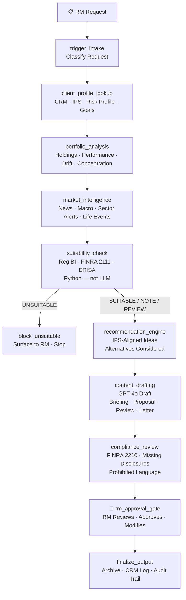

# Wealth & RM Copilot
### AI-Powered Relationship Manager Productivity Suite

> **Part of the [Financial Services AI Agent Suite](../README.md)** — the client-facing intelligence layer that works alongside [Financial Crime Investigation](../01-financial-crime-investigation-agent/), [AML/TMS Enhancement](../02-aml-tms-enhancement-agent/), [KYC/CDD Perpetual](../03-kyc-cdd-perpetual-agent/), and [Real-Time Fraud Detection](../04-fraud-detection-agent/).

---

## The Problem

A wealth management firm with 50 Relationship Managers:
- **RMs spend 35-40% of time** on administrative prep — meeting briefings, proposal writing, client letters
- **12-15 hours/week per RM** on tasks that don't require their expertise or judgment
- **Reg BI compliance burden** — every recommendation requires documented suitability rationale
- **Inconsistent quality** — junior RMs lack the template/knowledge base senior RMs have built over years
- **Client retention risk** — underprepared meetings damage relationships with HNW clients

**This copilot reclaims 10+ hours/week per RM while improving quality and compliance documentation.**

---

## Workflow

```
┌──────────────────────────────────────────────────────────────────────────────┐
│                     Wealth & RM Copilot (LangGraph)                          │
│                                                                              │
│  trigger_intake → client_profile_lookup → portfolio_analysis →               │
│  market_intelligence → suitability_check →                                   │
│                                                                              │
│  ┌────────────────────────────────────────────────────────────────┐          │
│  │  Suitability Routing (Python — not LLM)                        │          │
│  │  UNSUITABLE    → block_unsuitable → END (RM notified)          │          │
│  │  SUITABLE      → recommendation_engine                         │          │
│  │  SUITABLE_W_NOTE → recommendation_engine + disclosures         │          │
│  │  NEEDS_REVIEW  → recommendation_engine + flagged items         │          │
│  └────────────────────────────────────────────────────────────────┘          │
│         ↓                                                                    │
│  recommendation_engine → content_drafting → compliance_review →              │
│  👤 rm_approval_gate → finalize_output                                       │
└──────────────────────────────────────────────────────────────────────────────┘
```

### Workflow Diagram (Mermaid)



---

## Request Types & Outputs

| Request Type | Output | RM Use Case |
|---|---|---|
| **MEETING_PREP** | Client briefing with talking points | Prepare for quarterly/annual review |
| **REBALANCING_PROPOSAL** | Formal rebalancing proposal | Portfolio drifted from IPS targets |
| **INVESTMENT_PROPOSAL** | Investment proposal with Reg BI rationale | Present new investment idea |
| **PORTFOLIO_REVIEW** | Performance review with forward commentary | Annual review document |
| **CLIENT_COMMUNICATION** | Personalized letter/email draft | Respond to market events, life events |
| **ALERT_RESPONSE** | RM action brief | Market alert, life event detected |

---

## Demo Client Personas

| Client | AUM | Profile | Key Issues |
|---|---|---|---|
| **Margaret Chen** | $3.2M | 71, widowed, retired exec, conservative | RMD deadline, estate planning, DAF interest |
| **James & Sarah Thornton** | $875K | 46, dual-income, moderate-aggressive | US equity overweight after rally, college funding |
| **David Okafor** | $5.8M | 53, business owner, aggressive | Alternatives underweight, private credit proposal |
| **Martinez Family Trust** | $12M | Multi-gen, ESG, moderate | Inflation concerns, fossil fuel-free mandate |

---

## Regulatory Coverage

| Regulation | Coverage |
|---|---|
| **Reg BI (17 CFR 240.15l-1)** | Care, Conflict, Disclosure, Compliance obligations; cost analysis; alternatives documented for every recommendation |
| **FINRA Rule 2111** | Reasonable basis, customer-specific, quantitative suitability — Python determination, not LLM |
| **FINRA Rule 2210** | Communications compliance check — prohibited language, missing disclaimers, forward-looking caveats |
| **FINRA Rule 4512** | Customer account information currency check; IPS refresh flagged if >24 months |
| **ERISA (29 U.S.C. § 1001)** | Retirement accounts flagged; fiduciary disclosure auto-added; prohibited transaction screen |
| **SEC Investment Advisers Act** | Fiduciary duty documentation; conflict of interest disclosure |
| **SEC Rule 204-2 / FINRA 4511** | Append-only audit trail; 6-year retention flagged |
| **Form CRS** | Reg BI disclosure reference added to all client-facing outputs |
| **18 U.S.C. § 1960** | No SAR/investigation references in any client-facing content |

---

## Key Design Decisions

**LLM role:** Draft content only. Suitability determinations are Python.
**RM role:** Mandatory approval before any client delivery. RM is accountable professional.
**Unsuitable routing:** Python detects IPS conflicts, risk mismatches, and prohibited securities — blocked before draft is created.
**Reg BI documentation:** Every recommendation includes cost analysis, alternatives considered, and best-interest rationale — pre-populated for RM to review.

---

## ROI

| Metric | Before | With Copilot | Reduction |
|---|---|---|---|
| Meeting prep time per RM | 2-3 hrs/week | 30 min | **80%** |
| Proposal writing time | 3-4 hrs each | 45 min | **75%** |
| Compliance documentation gaps | ~15% of reviews | ~2% | **87%** |
| Annual RM hours saved (50 RMs) | — | 26,000 hrs | — |

**Annual savings (50 RMs, $120/hr fully loaded):**
- 50 RMs × 10 hrs/week × 50 weeks × $120/hr = **$3.0M annually**
- Reduced compliance incidents (E&O, fines) = **+$500K**
- **Total: ~$3.5M annually**

---

## Quick Start

```bash
cp .env.example .env
# Add OPENAI_API_KEY

pip install -r requirements.txt
streamlit run app.py
# Open: http://localhost:8505
```

---

## Project Structure

```
05-wealth-rm-copilot/
├── app.py                          # Streamlit dashboard (6 tabs)
├── agent/
│   ├── graph.py                    # 10-node LangGraph DAG
│   ├── nodes.py                    # All 11 node functions
│   ├── state.py                    # WealthRMState TypedDict (40+ fields)
│   └── prompts.py                  # 6 LLM prompt templates
├── data/fixtures/
│   ├── sample_clients.json         # 4 demo client personas
│   └── sample_requests.json        # 4 demo scenarios
├── tests/
│   └── test_graph.py               # Compilation + routing + regulatory tests
├── .env.example
├── Dockerfile
├── docker-compose.yml
└── railway.toml
```

---

## Part of the Financial Services AI Suite

```
01 · Financial Crime Investigation  →  Investigate AML alerts end-to-end
02 · AML/TMS Enhancement            →  Reduce false positive alert volume
03 · KYC/CDD Perpetual              →  Automate customer due diligence lifecycle
04 · Real-Time Fraud Detection      →  Sub-200ms payment fraud prevention
05 · Wealth & RM Copilot (this)     →  RM productivity + Reg BI compliance
06 · Regulatory Change Agent        →  Coming soon
```
